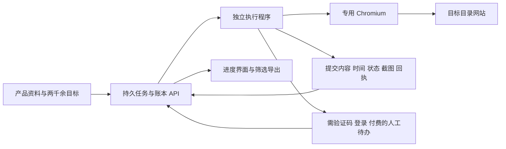

# Agent 浏览器与外链提交工具调研

核验日期：2026-09-27。范围：26 项官方文档、官方产品流程或公开源码参考；已打开对应来源。商业产品能力仅为官方披露，未购买或运行实测。未公开的后端、模型、数据库和浏览器技术栈不作推断。

## 决策

建议给外链自动化增加独立浏览器环境，首选 Playwright 管理的 Chromium 和专用用户目录，保留日常 Ego。没有必要先购买冠名“Agent 浏览器”的产品，也不需要整体重写 ExternalLink。

关键调整是让执行程序通过正式任务 API 领取产品资料、目标站和写回结果，让浏览器负责目标网站操作。插件继续作为查看进度、编辑资料和人工辅助入口。这样日常任务启动、登记不再依赖 agent 打开插件内部页、点重载和点批量开始。

这属于新增受支持的执行架构，不能解释为解除当前工具的自动安全拒绝。Playwright 官方支持扩展测试，只能证明该 SDK 的能力；还不能证明本机新环境已经接通或 ExternalLink 已兼容。先验收控制通道，再投入全库队列改造。

## 浏览器控制与 agent 执行：12 项

| 编号 | 官方来源 | 实现办法与对应问题 | 对本项目的判断 |
| --- | --- | --- | --- |
| 1 | [Playwright 扩展测试](https://playwright.dev/docs/chrome-extensions) | 用自带 Chromium 和持久上下文加载自有扩展；官方示例直接测试扩展弹窗页面。 | 首选基础。可见窗口便于验收；扩展开发与日常批量执行分开。官方提醒 Chrome/Edge 已移除所需侧载参数，因此不能把普通 Chrome 启动方式直接照搬。 |
| 2 | [Microsoft Playwright MCP](https://github.com/microsoft/playwright-mcp) | 将浏览器能力作为 MCP 工具提供给 agent，主要利用结构化无障碍快照；README 也推荐编码代理评估 CLI＋Skills。 | 正式连接 Codex/Claude 的候选通道。安装后仍需验证工具可用性和权限，不能把 MCP 当成无条件授权。 |
| 3 | [Vercel agent-browser](https://github.com/vercel-labs/agent-browser) | 面向 agent 的浏览器 CLI，提供元素引用、专用 profile、会话状态和标签页绑定。 | 适合“agent 下命令，专用浏览器执行”。固定 profile 和标签页可减少串用日常窗口；登录持久化不能保证服务端会话永不过期。 |
| 4 | [Browser Use](https://github.com/browser-use/browser-use) | MIT 开源代理库，支持本地/云浏览器与 CLI。 | 适合不同目录的表单识别和动作规划；需要接入本项目账本与成功证据规则。 |
| 5 | [Stagehand](https://github.com/browserbase/stagehand) | MIT 开源浏览器 SDK，程序化动作结合 act、observe、extract，可使用本地浏览器或 Browserbase。 | 适合稳定流程使用规则、变化字段交给 AI。当前资料为 v4，不能混用旧版 Playwright 初始化示例。 |
| 6 | [Skyvern](https://github.com/Skyvern-AI/skyvern) | AGPL 开源核心，组合浏览器、AI 工作流、API 和 UI，可自托管或使用云服务。 | 异构表单自动化的完整候选；部署和适配投入较多，不保证任意目录提交成功。 |
| 7 | [Steel Browser](https://github.com/steel-dev/steel-browser) | Apache-2.0 开源浏览器 API，可 Docker 自托管；支持会话、自定义扩展、日志和调试界面。 | 如果需要保留扩展并服务化，值得做兼容性试验；项目标注 public beta，不能当作已验收替代品。 |
| 8 | [Browserbase Live View](https://docs.browserbase.com/platform/browser/observability/session-live-view) | 托管浏览器提供实时观看和交互，可以嵌入自己的界面。 | 对应“清楚看到 agent 做什么”和人工接管；逐站任务与结果账本仍由 ExternalLink 负责。 |
| 9 | [Browserless BaaS](https://docs.browserless.io/baas/start) | Playwright/Puppeteer 通过 WebSocket 控制远程浏览器；提供会话与 LiveURL 接管能力。 | 适合把现有脚本迁出桌面；会话时长和并发有限制，不等于永久保存运行中的页面。 |
| 10 | [Cloudflare Browser Run](https://developers.cloudflare.com/browser-run/) | 原 Browser Rendering；通过 Playwright、Puppeteer、CDP 等控制云端浏览器，并支持会话复用。 | 与现有 Cloudflare 部署接近，可评估云执行；不能假设支持当前扩展的所有 API，也不能将截图 REST 接口等同于完整提交执行器。 |
| 11 | [Ui.Vision MCP](https://ui.vision/mcp) | 本地 Node MCP 桥连接浏览器扩展，agent 可运行宏、读页面和日志。 | 可沉淀稳定站点宏；仍依赖扩展，不能优先解决当前对扩展控制的依赖。 |
| 12 | [Automa](https://github.com/AutomaApp/automa) | 浏览器扩展内的积木工作流，支持填表、截图、采集与定时任务。 | 适合固定目录的小批量宏；仍是扩展架构。源码涉及 AGPL 与商业许可，不能笼统标为无限制免费组件。 |

## 断点恢复与人工交接：5 项

这些组件解决“跑到一半怎么办”，不负责解除浏览器工具限制；控制通道通过验收后再选一种合适的编排方案，不需要全部引入。

| 编号 | 官方来源 | 可借鉴的办法 | 必须补齐的业务边界 |
| --- | --- | --- | --- |
| 13 | [Crawlee Request Storage](https://crawlee.dev/js/docs/guides/request-storage) | URL 队列落盘、批量入队，并驱动 Playwright/Puppeteer crawler。 | 适合全库入口探测与分类。默认存储可能在启动时清理，必须显式配置持久存储；抓取完成不能算提交成功。 |
| 14 | [BullMQ 重试](https://docs.bullmq.io/guide/retrying-failing-jobs) · [幂等任务](https://docs.bullmq.io/patterns/idempotent-jobs) | 将每站拆成任务，失败退避重试，任务保持简单。 | 无法由队列自动保证第三方表单只提交一次。提交后失联应先核验结果，不能直接重投。 |
| 15 | [Temporal Durable AI](https://docs.temporal.io/ai) | 工作流在进程故障、网络超时或等待人工数天后恢复。 | 保存工作流进度不等于保存浏览器 DOM；适合复杂长任务，首版可能投入过大。 |
| 16 | [Cloudflare Workflows](https://developers.cloudflare.com/workflows/) | 持久步骤、失败重试、休眠及等待外部事件。 | 适合复用现有 Cloudflare 平台做调度；浏览器会话失效仍需执行器恢复，不能在重试步骤中盲目再次提交。 |
| 17 | [n8n Wait](https://docs.n8n.io/integrations/builtin/core-nodes/n8n-nodes-base.wait) | 暂停时把执行数据保存到数据库，满足时间或回调条件后恢复。 | 可参考人工完成验证码/登录后的回调继续；它本身不是浏览器控制器。 |

## 现有外链提交产品：9 个实际案例

这里区分自动化软件与人工代投。网页公开的业务流程有参考价值，但不能据此宣称知道其私有技术栈或实际成功率。

| 编号 | 官方来源 | 可证实的架构和登记机制 | 本项目可借鉴之处与限制 |
| --- | --- | --- | --- |
| 18 | [Submify Codex 工作流](https://submify.app/docs/codex) | 平台保存产品和机会，通过 API 派发任务；Codex 每次领取目标，操作站点并写回 submitted、live、needs_user 等状态及证据。 | 最贴近当前改造：任务和账本正式开放给 agent，不必把管理插件页面当 API。仍需正常浏览器授权。 |
| 19 | [Submit a Tool](https://submitatool.com/pricing) | 扩展复用产品资料，逐站自动填写提交；遇登录/CAPTCHA 暂停；提供提交账本、报告和后续复查。 | 借鉴阻碍分类和复查计划。官网把 site: 搜索命中用于 Indexed 判断，不能照搬成权威索引结论；整体能力未实测。 |
| 20 | [Backlink Pilot](https://github.com/s87343472/backlink-pilot) · [调度源码](https://github.com/s87343472/backlink-pilot/blob/main/src/submit.js) · [登记源码](https://github.com/s87343472/backlink-pilot/blob/main/src/tracker.js) | Node CLI 读取产品配置，调用专用/通用站点 adapter；YAML 记录站点、状态、时间和详情。 | 可借鉴适配器模式。源码调度层把 adapter 正常返回记作 submitted，缺少强制成功证据门槛；文件账本也不足以直接承担多产品并发。作为代码参考，不能直接替换生产系统。 |
| 21 | [Launch to Win](https://launchto.win/) · [WebMCP](https://launchto.win/webmcp) | 产品资料包通过 API、深链接、扩展和 agent 使用；WebMCP 提供读取/建立资料包工具，按产品记录提交历史。 | 借鉴结构化资料接口。公开通用流程包含人工检查和提交；当前新账号关闭，需要候补，不能推荐立即采购。 |
| 22 | [Donkey Directories](https://www.donkey.directory/) | 产品档案＋Chrome 自动填表扩展＋每产品独立进度板；支持人工标记状态。 | 多产品隔离、资料复用值得借鉴；官方足以证实 autofill，不能证实任意两千站无人值守。 |
| 23 | [Submit Juice](https://www.submitjuice.com/) | 收集问卷→定制清单与文案→人工团队投稿→Airtable/报告交付，FAQ 明确不用 bots。 | 交付逐站记录和上线链接，而非仅声称“已运行”；属于人工服务，不能解决 agent 控制通道。 |
| 24 | [LaunchDirectories 提交服务](https://launchdirectories.com/submit) | 人工选择目录、注册、分类和提交；检查已有 listing，并交付链接、截图和账号资料。 | 借鉴去重与可核对证据；不是专用自动化浏览器。 |
| 25 | [BacklinkBot 目录服务](https://backlinkbot.ai/directory-submission-service) · [报告说明](https://backlinkbot.ai/backlink-sample-report) | 目录代投页面明确由人执行；报告区分 live、in review、rejected 并附 proof link。 | 借鉴“提交”和“上线”分离及交付前复查。其外联 agent 属于另一个产品用途；示意报告不是实际成功率证据。 |
| 26 | [ListingBott](https://listingbott.com/) | 托管提交、目标清单审核、阶段报告及人工复核；首屏称 AI 研究/人工提交，FAQ 又有 bot 发布表述。 | 可以确认有人参与，无法确认自动化比例。借鉴重复检测和持续更新状态，不能把营销文案当作纯 agent 架构证据。 |

额外可核查参考：

- [Submify 扩展与 agent 日志](https://submify.app/docs/chrome-extension)：公开执行步骤与停止/继续流程。
- [Submify 状态与 CSV 导出](https://submify.app/docs/backlink-tracker)：按产品记录来源、目标、状态和更新时间。
- [Playwright Trace Viewer](https://playwright.dev/docs/trace-viewer)：调试动作、截图和网络事件；仍需业务回执来判定提交结果。
- [Claude Code Chrome 集成](https://code.claude.com/docs/en/chrome)：可作为 agent 客户端替代，但仍涉及权限、登录和连接恢复，不能据此保证比现有链路可靠。

## 对 ExternalLink 的落地选择

保留 Neon 作为唯一权威数据源，复用产品档案、目标库、历史回执、R2 图片和现有成功判断规则。按 Submify 的分层方式增加正式的领取任务、记录步骤、写入结果和查询证据接口。

首版使用 Playwright 专用 Chromium；先复用项目已有 Python Playwright 实现的可用部分，不直接把其本地 SQLite 或固定候选限制搬入新主流程。只有通用表单规则不足时，再评估 Browser Use 或 Stagehand 其中一种，不同时叠加多个控制器。

如果要求关电脑后继续运行，执行程序必须部署到持续在线的主机，或接入 Browserbase/Browserless 等云浏览器；仅安装本地浏览器无法在机器关机时工作。Steel 适合自托管浏览器服务的后续评估；无需一开始全部引入。

每个产品＋目标站拥有独立任务。站点能力标签包括免费/付费、需账号、验证码类型和最后核验时间；执行状态包括待执行、执行中、待人工、已提交待确认、已确认提交、已上线、失败待重试、不适配。记录提交内容快照、开始/提交/核验时间、实际入口、错误原因和证据地址；站点能力会变化，不能把一次判断永久套用到所有产品。

阻碍只暂停该站，其他站继续。未完成的人工会话优先保留；会话资源不足时先告知可保留范围并记录恢复入口，不以关掉所有待办页解决容量问题。对提交后断线的任务先查回执，不能用队列重试重复投稿。

## 实施前验收

1. 建立明确授权且工具实际可调用的独立浏览器连接。用自有测试表单验证读取、填写、上传、截图和重启后登录状态，不触碰已被当前工具拒绝的内部页。
2. 任务 API 完成领取、步骤写入和结果回读；验证 Neon 记录与进度界面一致。日常任务启动不依赖插件重载。
3. 混合样本验证免费、登录、验证码、付费、无表单、提交后网络中断等分支。每站都有原因和证据，不把“点过提交”判作成功。
4. 主动中断执行程序，恢复后确认已完成任务不重投，待人工任务不阻塞其他目标，新产品不覆盖旧产品记录。
5. 样本通过后分批扩大至全库；目标是全部目标都有可核对结论，并非保证全部第三方目录接受提交。

本轮仅调研和更新中文交接文档。未安装框架、未修改权限、未启动新浏览器执行器、未投稿、未改云端数据。当前没有证据支持“只换 Claude/skill/浏览器名称即可解决所有拒绝和长任务故障”。
