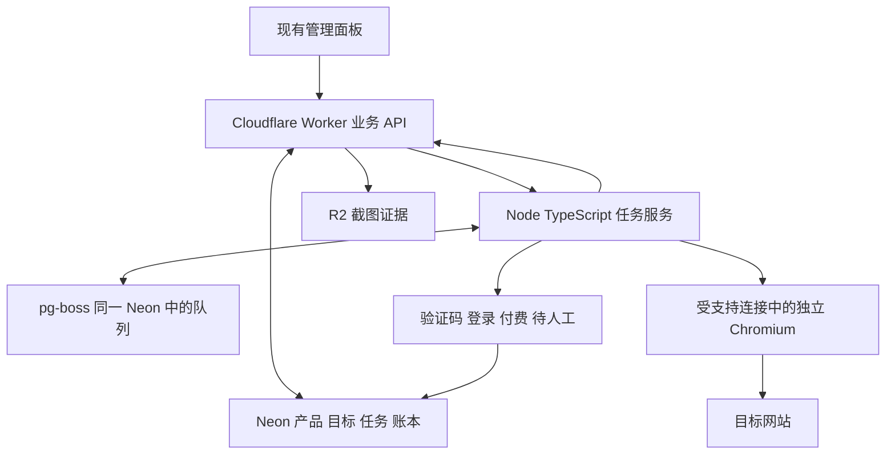

# 执行方案可行性判定

日期：2026-09-27。检查基线：`9b064af`。

## 判定

**当前结论：架构有官方能力依据，当前环境的端到端可行性尚未通过验证，不进入生产迁移。**

上一轮“建议换独立浏览器”的表述属于技术方向，不是实测通过结论。用户要求先确认有效再改造，这一要求作为生产迁移的前置门槛。

更新：独立浏览器普通网页控制已取得现场证据，见 [连接实测与选型](浏览器连接实测与选型-2026-09-27.md)。Playwright 和 agent-browser 均完成合成表单与上传；Playwright 两轮连接验收通过，agent-browser 存在一次关闭重开连接失败。此前“没有新执行器连接证据”的结论已更新。当前仍没有通过该执行链产生的真实站方投稿、Neon 回读和在途任务故障恢复证据，不能将浏览器层通过等同于生产执行器验收。

历史项目记录确认 Computer Use 对扩展内部页发生自动安全拒绝，见 `docs/外链投稿阻碍登记-2026-09-27.md:8`、`:45`。本轮没有启动 Playwright/CDP/DevTools 或更换入口重做被拒绝操作。正式工具接入和其允许范围必须先验证；不能以新增执行器规避已明确拒绝的动作。

## 本轮已有证据

| 检查 | 结果 | 能证明什么 |
| --- | --- | --- |
| Git 远端更新检查 | `origin/main` 无领先提交，工作区初始干净 | 审计基于当前 main；远端新分支不擅自合入 |
| Worker 事件接口 | `cloud/worker/src/index.mjs:388` 通过事务写入 run/attempt/step，路由位于 `:917` | 已有步骤登记基础，不等于已有任务领取队列 |
| R2 证据接口 | `cloud/worker/src/index.mjs:863` 附件路由 | 已有图片证据存取基础，不等于 trace ZIP 已受支持 |
| Python 浏览器程序 | `src/browser.py:45` 起启动 Playwright，使用 context/storage_state | 有实现参考；本轮未运行，不能证明新环境已可控制或保留任意登录 |
| 本地检查 | `node --test --test-reporter=dot tests/cloud-worker-core.test.mjs tests/automation-ledger.test.mjs tests/automation-integration.test.mjs` 通过 | 3 个测试文件中的本地逻辑与源码断言通过；没有真实浏览器、生产数据库或站方提交验收 |
| 官方浏览器接入文档 | [Developer mode](https://learn.chatgpt.com/docs/browser)、[MCP](https://learn.chatgpt.com/docs/extend/mcp?surface=cli) | 存在正式接入方式；不能证明当前账户/会话已具备权限，也没有承诺解除全部内部页限制 |

额外静态发现：旧 Python 提交器在点击后直接记成功（`src/submitter.py:178` 起），未复用当前扩展的证据闸门；部分异常分支传 `error_msg`，而 `src/db.py:268` 的函数参数为 `error_type`，可能使失败登记再次抛错。它还使用 SQLite 和默认 20 条候选。因此本轮明确不将旧 Python 程序直接启用为生产执行器，这些发现未在真实浏览器复现，也未顺带修改旧代码。

只读子代理核对本机 Node 为 `v22.23.1`，满足队列库声明的最低 Node 版本；Neon PostgreSQL 的当前服务端版本及 pg-boss 连接没有实测。

## 收敛的候选技术栈

以下是一套准备接受验证的设计，不是已部署状态。

| 层 | 选定方案 | 原因 |
| --- | --- | --- |
| 执行服务 | Node.js 24＋TypeScript（连接试验为 24.21.0） | 与现有 JS 规则、Worker 和证据判断逻辑同语言；22.12+ 原为最低兼容候选，后续先固定到实测运行时；旧 Python 仅作参考，不同时维护第二套主账本 |
| 浏览器 | Playwright＋其配套 Chromium，独立用户目录 | 正常网页的表单、上传、截图由程序控制；日常批量路径不要求进入扩展内部页或点重载 |
| 持久任务 | pg-boss，使用同一 Neon PostgreSQL 的独立 schema | 采用现成 Postgres 队列处理领取、重试和存活检测，不再叠加 Redis/Temporal/Cloudflare Workflows 三套调度；具体 Neon 连接与事务兼容性仍需隔离环境实测 |
| 业务 API | 现有 Cloudflare Worker，扩展任务、进度和结果接口 | 复用鉴权、资料、事件和 R2 访问；pg-boss 运行在 Node 服务中，不把常驻浏览器塞进普通 Worker |
| 权威数据 | 现有 Neon：产品、目标、业务任务、成功账本和步骤 | 沿用 destinationKey＋profileId 去重；队列执行完成不能直接映射为站方提交成功 |
| AI | 复用 Worker 的 `/v1/ai/plan`、`/v1/ai/vision-plan` 等接口 | 输出受约束的动作建议，现有成功证据判断继续独立；首版不同时接入 Browser Use 和 Stagehand |
| 证据和界面 | 现有 R2 图片、Neon 时间线、现有管理面板 | 增加云端分页查询与提交内容快照，复用现有展示；实时视频并非首版已具备能力 |
| 部署 | 验证阶段隔离环境；通过后在持续在线的 Linux 主机运行 Node/浏览器 | 长任务独立于聊天结束和插件重载；只在笔记本上运行不能承诺关机继续 |

[pg-boss 官方](https://github.com/timgit/pg-boss)要求 Node 22.12+、PostgreSQL 13+，提供现成任务队列。[运行管理文档](https://pgboss.io/api/ops)包含心跳失联和过期任务处理，但队列语义不能保证第三方表单外部副作用恰好发生一次。其启动可能创建/迁移 schema，验证时必须使用独立测试数据库或分支，不直接对生产执行默认启动。

入队调用走 pg-boss 正式 API/事务适配方式，不从 Worker 手写其内部表。业务任务和入队请求需要事务一致性；过期执行器的回写需要版本/所有权校验。浏览器执行后的结果先持久化并回读，再完成相应队列步骤。

## 必须通过的验收顺序

1. **P0：控制通道。** 在正式支持且允许该用途的连接内，实际验证 agent 能调用独立浏览器；自有普通网页完成读取、填写、上传、截图和重启后的会话检查。本机 Playwright 操作分项已实测通过，合成 Cookie/localStorage 可恢复；真实登录和长期运行未测，不能通过重试被拒绝入口来代替。
2. **P1：登记闭环。** 隔离测试数据完成领取一项任务、保存提交内容、步骤与图片、写入结果、云端重新读取并显示。入队和结果写入失败必须可见，不静默丢事件。
3. **P2：故障恢复。** 在自有测试服务模拟提交前中断、提交后回执丢失、数据库断连、两个执行进程争抢同一任务。提交后不确定转为待核验，禁止自动重投；测试样本中不能出现重复发送。
4. **P3：真实小批。** 从实时云端选择适配且获准的目标，拿到真实免费提交回执并回读账本；同时验证登录、验证码、付费只停该站，其他任务继续。模拟表单通过不能替代这一关。
5. **P4：规模验收。** 冻结 50 个混合目标，验证全部有结果/阻碍原因、超过 20 个人工待办仍能推进、第二个产品独立登记；通过后才扩大至两千余目标。

只有 P0–P3 的证据齐全，才可说“该执行链在指定环境和样本上可行”；P4 通过才进入全库迁移。任何阶段的纯工具拒绝都属于环境阻塞，不归因于目标站点，也不通过换工具规避。

全库完成的定义是每个目标都有可追溯处理结论。真实提交、待审核、已上线、需要人工、付费、不适配、技术失败分别统计。不存在凭本轮资料就保证所有第三方站点接受投稿的依据。

## 交接状态

本轮完成代码/官方资料核对和 3 个本地测试文件检查。浏览器原型未执行、生产数据未改、框架未安装、未新增投稿。本结论优先于上一份调研中容易被理解为“已经确认可用”的推荐措辞。下一步是正式控制通道验收，不是实施全库重构。
