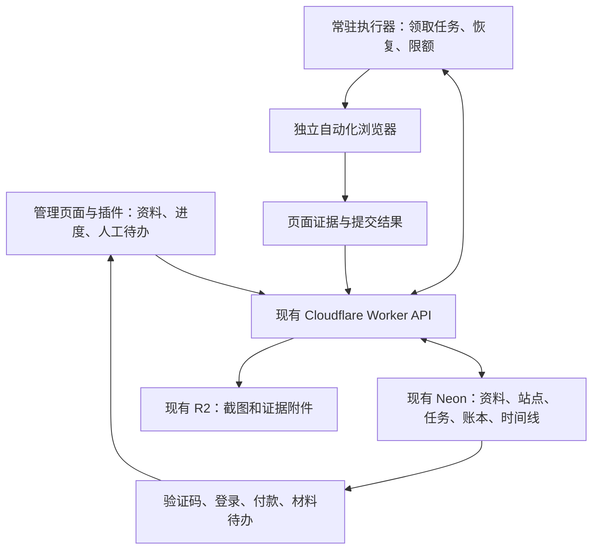

# 批量外链执行架构审计与改造建议

日期：2026-09-27。代码基线：`18da74d`；扩展源码版本：`3.7.122`。

后续判定见 [执行方案可行性判定-2026-09-27.md](执行方案可行性判定-2026-09-27.md)：当前环境端到端未验证，生产迁移未放行。正式控制通道验收优先于本文后续业务改造步骤。

## 结论与范围

建议保留 Neon、R2、外链库、网站资料、成功账本和已验证站点规则，增加独立常驻执行器与持久任务队列。Ego 和插件继续用于查看、人工接管与单站辅助；长期批量执行不再依赖代理操作扩展设置页和反复重载插件。

本轮完成源码审计、官方方案核验及 Ego 窗口只读检查。没有实施执行器迁移、重载插件、投稿、改变自动化任务或写入生产云端。没有重新查询完整 Neon 数据，历史数量不能充当本轮实时统计。

用户目标是每个目标站点都有可追溯结论，适配且免费可自动完成的站点实际提交，验证码、登录、付款、材料不足等单列待办，新产品复用站点经验并独立去重。全库处理完成必须与全部提交成功分开。

## 已核实的问题

| 事实 | 证据 | 影响 |
| --- | --- | --- |
| 历史有 ScreenCaptureKit `-3811/-3812` 捕捉失败，也有 `chrome-extension://` 页面被工具安全策略拒绝，两者不同 | `PROJECT_CONTEXT.md` 的 9 月 26 日窗口诊断和 9 月 27 日阻碍登记 | 不能统一说成用户权限未开启；重复重载无法解决全部原因 |
| 本轮 Ego 窗口绑定成功，读到工具栏上的 ExternalLink；当前窗口是用户其他 SEO 页面，未操作 | 本轮 `cua.getState`、`cua.getApp('com.citrolabs.ego.lite')` | 捕捉故障本次没有复现；不能据此声称扩展设置页、重载或云同步已验收 |
| 无人值守模式人工页签默认上限 20，队列内外循环均受容量限制；容量维护函数不自动关闭人工页签 | `extension/lib/unattended.js:5`、`extension/background.js:2418`、`:7650` | 少数待人工站点会堵住其余数千个目标；保护人工现场有价值，但不能以无限保留页签作为主任务模型 |
| 无人值守模式默认单批次预算为 8 小时、100 个任务、200 次模型调用；任务数配置最高 1000 | `extension/lib/unattended.js:5`、`:26` | 当前是有界批次，没有全库自动分片续跑；不能靠无限增加上限解决 |
| 重启有本地恢复，但进行中的任务均转人工；虽按是否尝试提交分为 `submitted_unconfirmed` 与 `needs_manual`，尚未按执行阶段自动恢复可确认未提交的任务 | `extension/background.js:3162`、`extension/lib/unattended.js:195` | 浏览器或后台中断会增加人工待办；可确认未提交的阶段应支持恢复，提交后不确定必须核验 |
| 首个 Profile 转人工后，同站点的其他 pending Profile 未在该停放路径重新入队；重启恢复有重建逻辑 | `extension/background.js:7663`、`:7777`、`:9997`、`:3310` | 代码路径存在兄弟任务滞留风险；未在真实浏览器复现，不标为实机已证 |
| 部分短暂故障直接进入 err/skip；缺少统一的持久延迟重试队列 | `extension/background.js:7850`、`:9675` | 执行器暂时失败不能被理解为站点不可提交 |
| 云端已有 run/attempt/step 表、事件写入及 R2 截图附件 | `cloud/worker/schema.sql:52`、`cloud/worker/src/index.mjs:917` | 可直接扩展，没必要重建一套数据库或重复成功账本 |
| 本地 automation ledger 每个 run 保留 600 个事件，另有 batchRunLog 保留 400 条日志；未同步 outbox 最多 3000 条并截断旧项；云端已有写入端点，未见分页查询运行记录端点 | `extension/lib/automation-ledger.js:8`、`extension/background.js:69`、`:74`、`:1008`、`cloud/worker/src/index.mjs:583` | 云端已确认的历史不受本地截断影响，但长时间断网后无法保证全部步骤回放；前台需要查询完整云端历史 |

已有成功证据校验、点击前保存 `submissionAttempted`、`submitted_unconfirmed` 防重投与 `destinationKey::profileId` 成功去重应保留。已有人工页关闭后任务仍保留的机制也可以复用，见 `extension/background.js:10539`。

Chrome 官方说明 MV3 service worker 可因空闲和超时退出，扩展必须为意外终止保存状态；这解释了持久恢复的必要性，但不能直接证明某次现场中断就是 MV3 引起。[官方生命周期说明](https://developer.chrome.com/docs/extensions/develop/concepts/service-workers/lifecycle)

## 技术选型

### 用户补充：先解决工具拒绝，再谈批量架构

用户明确指出当前首要阻塞是浏览器工具的协议限制和自动安全拒绝，包括 Computer Use，不能将讨论重心转移到队列容量。实施顺序修正为先做控制通道能力验收，再进行后文的业务改造。

- 项目现场记录明确包含 `chrome-extension://` 设置页访问被拒绝；这与站方 CAPTCHA、网络故障和 ScreenCaptureKit 捕捉失败分别处理。不能把改提示词、换 skill 或换浏览器品牌说成必然解除该限制。
- Playwright 官方扩展测试示例明确支持独立 Chromium 持久上下文加载扩展，并访问 `chrome-extension://<id>/popup.html`。这是可验证的自动化能力，但不等于当前受限会话已经获得该入口，也不能用于转接当前被明确拒绝的生产操作。
- OpenAI 官方提供浏览器 Developer mode / Enable full CDP access，以及本地 MCP 接入。官方没有在这些页面承诺解除所有内部协议限制；本会话也未显示可直接调用的完整 CDP 接口，不能宣称勾选后即可解决。[浏览器官方文档](https://learn.chatgpt.com/docs/browser?surface=app)、[MCP 官方文档](https://learn.chatgpt.com/docs/extend/mcp?surface=cli)
- Claude Code 的 Chrome 集成可填表、上传和读取 DOM，但也有权限与长会话连接中断；其当前 macOS Computer Use 文档把浏览器列为 view-only。不能保证更换到 Claude 原生浏览器/Computer Use 就能操作所有内部页。[Chrome 集成](https://code.claude.com/docs/en/chrome)、[Computer Use](https://code.claude.com/docs/en/computer-use)
- 必须先验证正式支持且允许该用途的控制通道。获准范围覆盖的独立测试配置可用于自有测试页面与中断恢复；扩展开发测试还需该接入明确允许扩展操作，不能替代或转接当前已被拒绝的内部页操作。不提前迁移全系统。
- 后续 agent 可通过受支持的 MCP/业务 API 调用执行器。Claude Code 与 Codex CLI 都是候选客户端；尚未进行本项目实测对比，不报告任何一方成功率更高。

| 方案 | 可以解决什么 | 本项目建议 |
| --- | --- | --- |
| 仅换 Ego 为普通 Chrome | 排查某些特定浏览器兼容问题 | 不作为主整改，人工容量、任务恢复、日志完整性仍然存在 |
| 安装 agent-browser skill / CLI | 给代理浏览器快照、点击、填表等操作接口 | 可以做诊断或交互辅助，不能替代业务队列、账本和成功核验；[官方仓库](https://github.com/vercel-labs/agent-browser) |
| Browser Use | 提供可嵌入应用的浏览器 agent，可选择本地或云浏览器 | 可做复杂站点适配实验，但不能把全库作为一个无限任务交给它；[官方仓库](https://github.com/browser-use/browser-use) |
| Playwright 执行器，按需接入 Stagehand | 稳定步骤用确定性自动化，未知页面用 AI 发现动作或抽取信息 | 推荐方向，首先完成单一 Playwright 驱动和队列闭环；[Playwright trace](https://playwright.dev/docs/trace-viewer)、[Stagehand 官方文档](https://docs.stagehand.dev/v4/first-steps/introduction) |

推荐 Node/TypeScript 作为新执行层，便于抽取和复用现有 JavaScript 纯模块。Stagehand 当前文档提供自己的浏览器驱动，不应假设是可直接替换的 Playwright 对象；若接入，应通过驱动接口且同一时刻只有一个控制者，避免同时接三套自动化框架。

仓库已经有 `src/browser.py` 的 Playwright 封装，但 `src/db.py` 仍使用独立 SQLite，`src/submitter.py:116` 默认只取 20 条候选。这些可作实现参考，不能未经迁移直接启用并形成第二个数据源。

如以后需要自动化扩展验收，应采用独立测试配置和 Playwright 附带 Chromium 的持久上下文。官方文档明确普通 Chrome/Edge 已移除所需的命令行扩展侧载参数；不能随意套用旧教程。[官方扩展测试说明](https://playwright.dev/docs/chrome-extensions)

## 目标结构

本机常驻执行器先完成验收；要在关掉笔记本后继续，执行器必须部署在一台持续在线的设备或服务器上。普通 Worker 继续做 API 和调度入口，不直接当作常驻完整浏览器。新增托管服务和模型成本由实际试跑测量，不先承诺价格或吞吐。

### 任务、站点与成功记录分开

- 站点知识记录投稿入口、适用产品类型、免费/收费方案、验证码类型及发生阶段、登录要求、材料要求、检测时间和证据。验证码、付费等允许多标签；只看到页面挑战时，内部投稿方式仍为未知。
- 每个产品与目标站点组合独立建任务，复用 `destinationKey::profileId`。新增产品生成自己的任务，不能因另一个产品提交过就跳过。
- 增加持久任务状态 `pending / running / retry_wait / human_required / verify_required / completed / excluded`，保留单独的 `publicationStatus` 区分已提交、审核中、已上线。
- 在 Neon 原有数据层增加任务领取、租约、心跳和到期恢复，事件仍写原有 run/attempt/step；插件和执行器共享同一任务所有权，避免两个设备重复点击提交。
- 每个任务保存领取版本；过期执行器不能覆盖新状态。提交前再查成功账本；已点击但结果不确定时只能核验，不能盲目重投。

### 人工待办不占用全库处理容量

- 筛选遇 CAPTCHA/登录/收费时，保存入口、原因、截图、时间和恢复步骤，完成该站本轮分类并继续下一站。
- 普通筛选页面完成证据保存后可以回收。已填写的重要表单和用户原有人工页保留；本次审计不关闭这些页面。
- 页面状态不能完整序列化。持久会话可以保存一部分登录状态，验证码及部分表单可能过期；重新进入时先验证现场，不能承诺无损恢复任何页面。
- 同站点不同产品串行执行，避免互相覆盖，但首个产品被拦不能吞掉其他产品的任务。

### 逐站登记内容

每次尝试必须可查询：产品、目标站点与实际入口、开始/完成/提交时间、原始资料版本、实际准备提交的标题/网址/简介/分类、媒体 ID 或摘要、已填写与已发送的区别、最终回执、公开链接、截图、阻碍原因、费用及币种（若可见）、下次重试时间、人工动作。既有时间线 metadata 可扩展，但当前通用日志没有保证保存每站完整提交内容，不能仅凭产品资料当前值反推历史投稿。

截图和 trace 仅作为私有证据；不保存验证码答案、密码、令牌到业务事件。现有自动化附件端点只接收校验后的图片，不能直接塞入 trace ZIP；如需 trace，单独扩展经过鉴权的附件类型与读取接口。

云端确认才移除待写事件；待写空间不足必须暂停新外部提交并说明原因，不能静默删掉未同步证据。提供云端分页查询与产品/站点/状态筛选，展示当前执行项、已分类覆盖率、提交结果和人工待办；未确认的本地结果明确显示待同步。

### 分片和失败恢复

- 每片例如 50 个任务，完成片段后继续领取下一片；主任务一直保留总进度。
- 每站设置执行超时和有限重试。导航超时等在提交前延迟重试，达到次数后归为“技术失败待复核”，不能标成“站点失效”。
- 只有影响全部任务的鉴权、云端持久化、浏览器整体故障才暂停执行器；普通单站阻碍不暂停全库。
- 分片只控制资源，不重置总成本授权。日费用/模型调用/运行时间上限独立计数，达到上限如实暂停，不能为继续跑而自动绕过。
- 规则按版本发布、在下一任务边界加载；插件核心变更仍需要正常更新，站点资料和选择器规则变化不应都要求重载插件。规则只用受限声明式数据，不向扩展下发任意可执行代码。

## 实施顺序与验收

1. **任务与登记闭环**：扩展现有云端 API，补持久任务、完整提交内容快照、分页查询、人工待办。复用现有设置页样式与纯模块。确认本机旧状态不能覆盖新队列。
2. **独立执行器**：一个隔离浏览器配置、一个执行进程开始，先按产品/站点串行；实现故障恢复、版本锁定及人工接管。用已知站点规则和现有证据判定先跑通，再决定是否接入 Stagehand。
3. **冻结 50 个混合目标验收**：包含可免费提交、验证码、登录、付费、不适配、无入口以及可模拟的超时情况。所有 50 个目标均有结论和证据；真实遇到的未知如实归类，不要求或伪造 50 个成功。
4. **故障验收**：提交前杀浏览器、点击后中断、云端暂时不可达、超过 20 个人工待办、同站多个产品、重复启动。要求不丢登记、不重复提交、不被人工容量拖停，云端回读与前台一致。
5. **全库分类与可提交任务执行**：读取当时 Neon 的真实去重目标数，以其冻结本轮分母；分片推进。新产品建新任务并复用有时间戳的站点知识，过期知识重新检查。

完成口径：冻结库中每个目标均有可追溯结果，无遗留未领取任务；技术失败和待人工单列未解决数。投稿成功、审核中、已上线分别统计。自动提交成功率、平均耗时和费用在试跑后测量，本轮不承诺数值。

## 本轮验证

- `git fetch origin` 后本地与 `origin/main` 一致，工作树原先干净。
- 源码与只读子代理交叉审计；Ego 原生窗口此次绑定成功，未触发重载或提交。
- `node --test --test-reporter=dot tests/*.test.mjs`：55/55 通过。测试通过不代表上述新架构已实现或实站提交成功。
